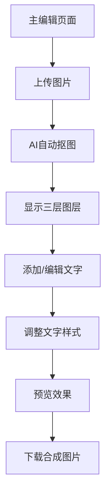

## 1. Product Overview
PosterLayer AI 是一个专业级在线海报设计工具，用户可以通过AI技术将照片中的人物自动抠图，并添加丰富的自定义文字图层，最终导出高质量的合成图片。该产品解决了用户想要快速制作专业级视觉内容的需求，无需复杂的设计软件即可获得工作室级别的设计效果。

目标用户：社交媒体内容创作者、品牌营销人员、摄影爱好者、小型企业主。产品价值在于将专业设计工具简化，让每个人都能轻松创作出具有Premium Studio Aesthetic的精美视觉内容。

## 2. Core Features

### 2.1 User Roles
本应用为单用户工具，无需注册登录即可使用全部功能。

### 2.2 Feature Module
PosterLayer AI 包含以下核心功能页面：
1. **主编辑页面**：三栏布局设计，左侧工具面板、中央画布区域、右侧图层管理面板。

### 2.3 Page Details
| Page Name | Module Name | Feature description |
|-----------|-------------|---------------------|
| 主编辑页面 | 图片上传模块 | 点击或拖拽上传照片，支持JPG/PNG格式，最大10MB，显示上传预览 |
| 主编辑页面 | AI人物抠图 | 自动检测并抠取人物，集成Remove.bg API，提供Mock fallback机制 |
| 主编辑页面 | 三栏布局 | 左侧工具栏、中央画布、右侧图层面板，Premium Studio Aesthetic设计 |
| 主编辑页面 | 文字编辑工具 | 多图层文字支持，Google Fonts集成，字体样式控制（粗体/斜体/字间距/行高/阴影） |
| 主编辑页面 | 交互控制 | 画布内直接拖拽、旋转、缩放文字图层，使用react-moveable实现 |
| 主编辑页面 | 图层管理 | 右侧面板显示图层堆叠顺序，支持图层选择、隐藏、删除、重排序 |
| 主编辑页面 | 导出功能 | 高质量PNG格式导出，保持透明背景支持 |
| 主编辑页面 | 撤销重做 | 支持操作历史记录，快捷键Ctrl+Z/Ctrl+Y |

## 3. Core Process
用户操作流程：
1. 用户进入主编辑页面
2. 上传旅行照片
3. 系统自动调用AI抠图API处理图片
4. 在图层预览区显示抠图结果
5. 用户添加并编辑文字内容
6. 调整文字位置、大小、颜色、字体
7. 预览最终效果
8. 点击下载按钮导出合成图片

## 4. User Interface Design

### 4.1 Design Style
- **主色调**：Creamy White (#F5F5F0) 背景，营造温暖专业感
- **强调色**：Cold Vintage Red (#8E1E22) 用于按钮和重要交互元素
- **按钮样式**：简洁矩形设计，微妙阴影，悬停状态颜色加深
- **字体**：Google Fonts集成，包括Playfair Display、Montserrat、Noto Serif/Sans、Caveat等
- **布局风格**：三栏专业布局（工具-画布-图层），最大化工作效率
- **图标风格**：简约线性图标，符合现代设计工具审美

### 4.2 Page Design Overview
| Page Name | Module Name | UI Elements |
|-----------|-------------|-------------|
| 主编辑页面 | 左侧工具栏 | 垂直排列工具图标，包含文字、上传、导出等功能，Cold Vintage Red强调色 |
| 主编辑页面 | 中央画布区域 | 主要工作区域，显示背景图片和文字图层，支持直接交互操作 |
| 主编辑页面 | 右侧图层面板 | 显示图层堆叠顺序，每个图层可单独控制，符合专业设计工具习惯 |
| 主编辑页面 | 文字编辑面板 | 展开式面板，包含字体选择、样式控制、排版参数等丰富选项 |
| 主编辑页面 | 交互控制手柄 | 选中文字时显示拖拽、旋转、缩放手柄，使用react-moveable实现精确控制 |

### 4.3 Responsiveness
桌面端优先设计，适配1200px以上宽度。移动端采用响应式布局，工具栏改为底部抽屉式，上传区域全屏显示。

### 4.4 3D Scene Guidance
本应用为2D图层叠加，无需3D场景。但建议为图层切换添加微妙的过渡动画：
- 图层切换使用淡入淡出效果，持续300ms
- 文字拖拽时添加轻微阴影提升层次感
- 按钮点击采用缩放动画，增强交互反馈